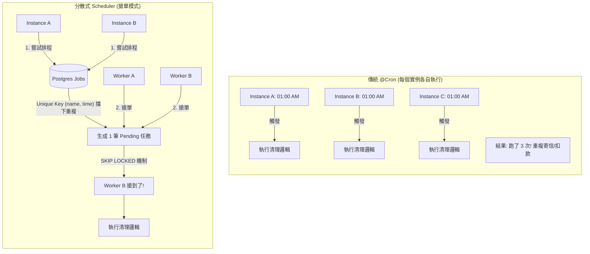

# Implementation Guide: CI/CD & Backend Scheduling (R1-03)

> **Related Task**: [R1-core-project-task](../project-tasks/R1-core-project-task.md) | **Roadmap**: [R1-core](../Roadmap/R1-core.md)

本指南涵蓋 R1 Milestone 最後兩項核心基礎建設：
1. **CI/CD**: 自動化建置與測試管道 (GitHub Actions + Nx)。
2. **Backend Scheduling**: 基於 PostgreSQL 的分散式排程機制 (避免 Redis 依賴)。

---

## Part 1: CI/CD (Nx + GitHub Actions)

### 1-1. Why? (為什麼需要？)
- **品質閘門 (Quality Gate)**: 確保每一筆 PR 合併前都通過 Build, Lint, Test。
- **Monorepo 效率**: 隨著專案變大，全量跑測試太慢。Nx 的 `affected` 機制能分析 Git 變更，**只針對受影響的專案**執行任務，大幅縮短 CI 時間。
- **一致性**: 確保本地通過的程式碼在乾淨的 CI 環境也能通過，避免 "Works on my machine" 問題。

### 1-2. Technology Stack (技術原理)

#### GitHub Actions
GitHub 提供的 CI/CD 平台。透過 YAML 定義 workflow，當特定事件 (push, pull_request) 發生時觸發。
- **Jobs & Steps**: 定義執行步驟 (checkout code, setup node, run commands)。
- **Caching**: 快取 `node_modules` 以加速安裝。

#### Nx CI Features
- **Nx Affected**: 透過比較當前 commit 與 base commit (通常是 `master` or `origin/master`)，計算出 Dependency Graph 中受影響的節點。
    - 例如：改了 `@share/contract`，則依賴它的 `backend` 和 `frontend` 都會被標記為 affected。
- **Target Defaults**: 在 `nx.json` 定義任務依賴 (e.g., build 之前要先 build dependencies)。

### 1-3. Implementation Steps (實作步驟)

#### Step 1: Create Workflow File
建立 `.github/workflows/ci.yml`。

```yaml
name: CI

on:
  push:
    branches:
      - master
  pull_request:

permissions:
  actions: read
  contents: read

jobs:
  main:
    runs-on: ubuntu-latest
    steps:
      - uses: actions/checkout@v4
        with:
          fetch-depth: 0 # 必須抓取完整 history 讓 Nx 分析 commits

      # 1. Setup Node.js + Cache (NPM)
      - uses: actions/setup-node@v4
        with:
          node-version: 20
          cache: 'npm'

      # 2. Install Dependencies
      - run: npm ci

      # 3. Nx Lint (Affected)
      - run: npx nx affected -t lint --parallel=3
      
      # 4. Nx Test (Affected)
      - run: npx nx affected -t test --parallel=3 --configuration=ci

      # 5. Nx Build (Affected)
      - run: npx nx affected -t build --parallel=3
```

#### Step 2: Configure Nx Base
確保 `nx.json` 正確設定 `defaultBase`，讓 Nx 知道要跟哪個分支比較。

```json
// nx.json
{
  "defaultBase": "master", 
  // ...
}
```

#### Step 3: Verification (驗收)
1. 發一個 PR 修改 `frontend` 的一個檔案。
2. 觀察 GitHub Actions Log，確認 `nx affected` 只有跑 `frontend` 相關任務，而跳過無關的 `backend`。

---

## Part 2: Backend Scheduling (Postgres-Based Queue)

### 2-1. Why? (為什麼需要？)
- **水平擴展問題 (Scaling Issue)**: 當後端部署多個實例 (Replicas) 時，若使用單純的 `@Cron`，每個實例都會同時執行同一個任務 (e.g., 每天凌晨發送報表)，導致重複執行。
- **避免過早引入 Redis**: 標準解法是 Redis/BullMQ，但在專案初期 (R1)，引入 Redis 增加運維複雜度。
- **現有資源利用**: PostgreSQL 9.5+ 支援 `SKIP LOCKED`，可以完美實作 "Job Queue" 且具備 ACID 特性。

#### Architecture Comparison (架構比較)



### 2-2. Technology Stack (技術原理)

#### JobSchedulerPort (Hexagonal Architecture)
定義一個介面 (Port)，讓業務邏輯不依賴具體排程實作。未來若改用 Redis，只需換掉 Adapter。

#### PostgreSQL Concurrency Features
- **Idempotency (冪等性)**:
    - 利用 `UNIQUE KEY (job_name, scheduled_time)` 防止重複產生任務。
    - `INSERT ... ON CONFLICT DO NOTHING`。
- **Consumer Locking (搶占鎖)**:
    - `SELECT ... FOR UPDATE SKIP LOCKED`: 這是關鍵。當多個 Worker 同時去 DB 撈任務時，DB 會自動跳過「已被鎖定」的行，讓每個 Worker 撈到不重複的任務。

### 2-3. Implementation Steps (實作步驟)

#### Step 1: Define Interface (Port)
`backend/src/core/domain/scheduling/scheduler.port.ts`

```typescript
export interface Job {
  id: string;
  name: string;
  data: any;
  status: 'pending' | 'processing' | 'completed' | 'failed';
  runAt: Date;
}

export abstract class JobSchedulerPort {
  // 生產者：排程一個任務
  abstract schedule(name: string, data: any, runAt: Date): Promise<void>;
  
  // 消費者：宣告自己可以處理哪些任務
  abstract registerHandler(name: string, handler: (job: Job) => Promise<void>): void;
}
```

#### Step 2: Create Schema (Adapter)
`backend/src/core/infra/scheduling/scheduling.schema.ts`

```typescript
import { pgTable, text, timestamp, jsonb, uuid } from 'drizzle-orm/pg-core';

export const jobs = pgTable('jobs', {
  id: uuid('id').defaultRandom().primaryKey(),
  name: text('name').notNull(),
  data: jsonb('data').default({}),
  status: text('status').$type<'pending' | 'processing' | 'completed' | 'failed'>().default('pending'),
  runAt: timestamp('run_at').notNull(),
  lockedAt: timestamp('locked_at'), // 用於超時重試
  createdAt: timestamp('created_at').defaultNow(),
}, (table) => {
  return {
    // 關鍵：確保同一時間、同名任務不重複
    uniqueJob: uniqueIndex('unique_job_idx').on(table.name, table.runAt), 
  };
});
```

#### Step 3: Implement Postgres Adapter (Service)
`backend/src/core/infra/scheduling/postgres-scheduler.service.ts`

我們實作一個 `PostgresSchedulerService` (作為 Adapter) 來處理 Worker Loop 與搶單邏輯：

```typescript
import { Injectable, OnModuleInit, Logger } from '@nestjs/common';
import { Job, JobSchedulerPort } from '../../domain/scheduling/scheduler.port';
import { SchedulingRepository } from './scheduling.repository';

@Injectable()
export class PostgresSchedulerService implements JobSchedulerPort, OnModuleInit {
    private readonly logger = new Logger(PostgresSchedulerService.name);
    private readonly handlers = new Map<string, (job: Job) => Promise<void>>();
    private readonly workerId = `worker-${Math.random().toString(36).substring(7)}`;

    constructor(
        private readonly repository: SchedulingRepository
    ) {}

    onModuleInit() {
        this.logger.log(`Starting worker ${this.workerId}`);
        // 使用遞迴 setTimeout 取代 setInterval，避免任務執行時間 > 間隔導致的重疊執行
        this.poll();
    }

    async schedule(name: string, data: any, runAt: Date): Promise<void> {
        await this.repository.createJob({ name, data, runAt });
    }

    registerHandler(name: string, handler: (job: Job) => Promise<void>): void {
        this.handlers.set(name, handler);
    }

    private async poll() {
        let nextInterval = 1000; // 預設間隔 1 秒

        try {
            const job = await this.repository.pollJob(this.workerId);
            
            if (job) {
                // 有任務！立即處理
                this.logger.log(`Processing job ${job.id}`);
                const handler = this.handlers.get(job.name);
                
                if (handler) {
                    try {
                        await handler(job);
                        await this.repository.completeJob(job.id);
                    } catch (err) {
                        this.logger.error(`Job failed`, err);
                        await this.repository.failJob(job.id);
                    }
                } else {
                    await this.repository.failJob(job.id); // No handler
                }
                
                // P.S. 策略優化：如果剛剛有任務，代表可能還有堆積，可以縮短下一次等待時間 (e.g., 0ms or 100ms)
                nextInterval = 100;
            } else {
                // 沒任務，維持一般心跳頻率 (或是可以實作 Backoff 策略：1s -> 2s -> 5s...)
                nextInterval = 3000; // 閒置時可以睡久一點，例如 3 秒
            }

        } catch (error) {
            this.logger.error('Polling error', error);
        } finally {
            // 確保這個回合跑完才排定下一次，避免 Race Condition 與資源浪費
            setTimeout(() => this.poll(), nextInterval);
        }
    }
}
```

> **效能優化筆記**: 
> 1. **Index Scan**: `pollJob` 使用的 SQL 因為有 Index 支援，即使每秒跑一次，對 Postgres 來說負擔極小 (不到 1ms)。
> 2. **Adaptive Polling**: 上述範例使用了動態間隔 (`nextInterval`)，忙碌時加速，閒置時減速，能進一步降低 DB 負載。

#### Step 4: Refactor Legacy Cron (Example)
如何將既有的 Cron Service 改造成分散式架構：

`backend/src/core/domain/auth/session-cleanup.service.ts`

```typescript
import { Injectable, OnModuleInit } from '@nestjs/common';
import { Cron, CronExpression } from '@nestjs/schedule';
import { Job, JobSchedulerPort } from '../../infra/scheduling/scheduling.port';
import { SessionRepository } from './auth.repository';

@Injectable()
export class SessionCleanupService implements OnModuleInit {
    constructor(
        private readonly sessionRepository: SessionRepository,
        // 1. 注入排程器 Port
        private readonly scheduler: JobSchedulerPort
    ) {}

    // 2. 啟動時註冊處理器 (Consumer)
    onModuleInit() {
        // 當 Worker 搶到任務時，會呼叫這裡
        this.scheduler.registerHandler('cleanup-sessions', async (job: Job) => {
            console.log(`[Job] Starting cleanup sessions...`);
            await this.sessionRepository.cleanupExpiredSessions();
        });
    }

    // 3. 原本的 Cron 只負責 "排程" (Producer)
    @Cron(CronExpression.EVERY_DAY_AT_1AM)
    async scheduleCleanupSessions() {
        // 技巧：將時間鎖定在 "當天 01:00"，確保生成的 Key 一致
        const runAt = new Date();
        runAt.setMinutes(0, 0, 0); 
        
        // 丟進 DB，如果別的實例已經丟過，這裡會被忽略 (Idempotency)
        await this.scheduler.schedule('cleanup-sessions', {}, runAt);
    }
}
```

---

## 總結
完成這兩項後，R1 Core 將具備標準的 **DevOps 流程** 與 **可擴展的背景任務能力**，為後續 Feature 開發打下穩固基礎。
