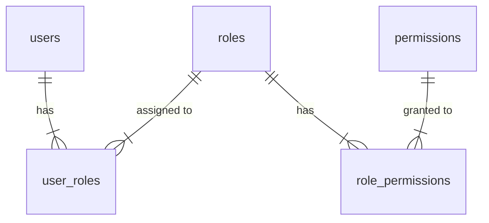

# Implementation Guide: Admin & RBAC Core (R2-01)

> **Related Task**: [R2-admin-rbac-project-task](../project-tasks/R2-admin-rbac-project-task.md) | **Roadmap**: [R2-admin-rbac](../roadmap/R2-admin-rbac.md)

本指南涵蓋 R2 Milestone 的第一階段核心基礎建設：
1.  **Admin Panel Foundation**: 前端後台佈局與路由保護。
2.  **RBAC Data Model**: 後端資料庫模型設計。
3.  **RBAC Core Infrastructure**: 權限守衛 (Guard) 與裝飾器 (Decorator)。

---

## Part 1: Admin Panel Foundation (Frontend)

### 1-1. Why? (為什麼需要？)
- **獨立環境**: 管理後台 (`/admin`) 應與前台 (`/app` 或 `/`) 區隔，擁有獨立的 Layout 與導航結構。
- **安全性**: 所有後台路由必須強制檢查 `Admin` 角色，防止一般使用者越權訪問。
- **DX (開發體驗)**: 建立統一的 Navigation Config，讓開發者只需設定 JSON 即可新增選單項目。

### 1-2. Implementation Steps (實作步驟)

#### Step 1: Layout & Navigation Status
建立 `src/routes/admin/+layout.svelte`，包含 Sidebar 與 Topbar。
定義 `src/lib/config/admin-navigation.ts`:

```typescript
export const adminNavigation = [
  { label: 'Dashboard', icon: 'home', path: '/admin', permission: 'dashboard.view' },
  { label: 'Users', icon: 'users', path: '/admin/users', permission: 'user.read' },
  { label: 'Roles', icon: 'lock', path: '/admin/roles', permission: 'role.read' },
];
```

#### Step 2: Protected Route Guard
利用 SvelteKit 的 `CheckAuth` (或 `hooks.server.ts`) 進行攔截。
驗證邏輯：
1.  使用者是否已登入？ -> 否則導向 `/auth/login`。
2.  使用者是否有 `admin` 角色？ -> 否則顯示 403 Forbidden。

---

## Part 2: RBAC Data Model (Backend)

### 2-1. Schema Design (DB Layer)
採用標準 RBAC Level 1 模型 (Flat RBAC)，並保留擴充性。



### 2-2. Implementation Steps

#### Step 1: Define Drizzle Schema
`backend/src/core/domain/access-control/access-control.schema.ts`

-   **Roles Table**: `id`, `name`, `code` (e.g., 'superadmin'), `description`.
-   **Permissions Table**: `id`, `code` (e.g., 'user.create'), `module`, `description`.
-   **Mapping Tables**: `users_to_roles`, `roles_to_permissions`.

#### Step 2: Seed Script
建立 `backend/scripts/seed-rbac.ts`，用於初始化系統：
1.  建立 `Super Admin` 角色 (擁有所有權限)。
2.  建立 `Admin` 角色。
3.  掃描 `PERMISSION_SCHEMA` 自動寫入 permissions table。

---

## Part 3: RBAC Core Infrastructure (Backend)

### 3-1. Technology Stack
-   **Permission-Based Authorization**: 不直接檢查 Role，而是檢查 Permission，讓權限配置更靈活。
-   **NestJS Guards & Decorators**: 利用 Metadata 機制宣告路由所需的權限。

### 3-2. Implementation Steps

#### Step 1: Permission Decorator
`backend/src/core/domain/access-control/decorators/permission.decorator.ts`

```typescript
import { SetMetadata } from '@nestjs/common';
export const PERMISSION_KEY = 'permissions';
export const Permissions = (...permissions: string[]) => SetMetadata(PERMISSION_KEY, permissions);
```

#### Step 2: RBAC Guard
`backend/src/core/domain/access-control/guards/rbac.guard.ts`

邏輯：
1.  取得 `Reflector` 的 metadata (需要的權限)。
2.  取得 `request.user` (由 AuthGuard 注入)。
3.  查詢 DB (或快取) 獲取使用者的所有 Permissions。
4.  比對：User Permissions 是否包含 Required Permissions。

#### Step 3: Module Integration
將 `AccessControlModule` 設為 Global 或由 `CoreModule` 匯出，確保所有 Feature Module 皆可使用 `@Permissions()`。

---

## 驗收標準 (Definition of Done)
1.  [Frontend] 進入 `/admin` 需登入且具備 Admin 權限。
2.  [Backend] 資料庫存在 `roles`, `permissions` 表且有預設資料。
3.  [Backend] API endpoint 掛上 `@Permissions('test')` 後，無權限 Request 回傳 403。
